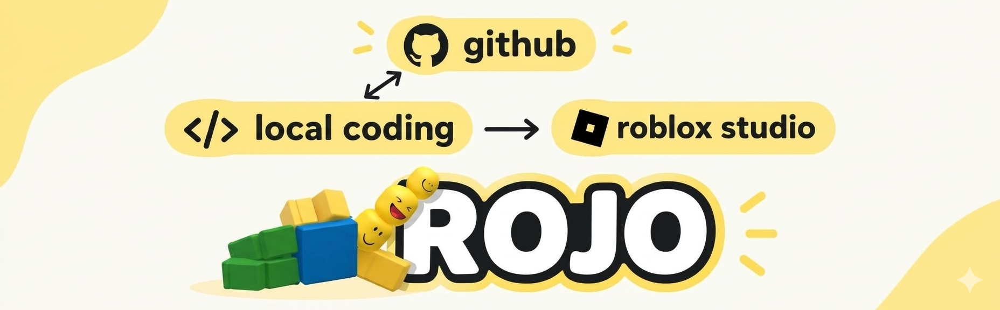
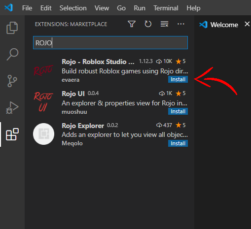
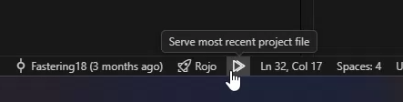

# Tutorial Rojo  

<p align="center">
  
</p>

## What is Rojo?  
Rojo adalah tool yang dipakai untuk mensinkronkan scripts dari **lokal** folder ke **Roblox Studio**.  

## Why bother?  
Dengan rojo, kita dapat menggunakan kode editor eksternal seperti VSCode atau vim, menghubungkan ke repository github untuk kolaborasi, dan better code assists (autocomplete, gpt, dll). Kode yang di ubah akan terupdate otomatis oleh rojo di studio dan kita dapat klik 'Play' untuk segera melihat efek dari script.  

## How  
Disarankan ikut steps dibawah agar tidak mempolusi pc anda:  

### 1. Install rokit (toolchain manager):  
https://github.com/rojo-rbx/rokit  
> [!TIP]  
> baca README dan install sesuai OS kalian, lalu restart pc agar `rokit` masuk ke PATH. Boleh ditambahkan manual.  

### 2. Setup Project  
Buat folder projek untuk game jika belum dibuat, jika sudah ada di github tim maka bisa `git clone`.  

1. Inisialisasi project (jika folder baru):
```sh
rokit init
```  

2. Install rojo:
```sh
rokit add rojo-rbx/rojo
rokit install
```  
command ini akan menambahkan `rojo` ke PATH dalam environment folder project, lalu verifikasi:

3. Verifikasi rojo:
```sh
rojo --version
```  

4. Setup rojo project:
```sh
rojo init
```  
Ini akan membuat file `default.project.json` dan folder `src/` berisi template scripts (client, server, shared).

### 3. Install Rojo Plugin di Roblox Studio  
Plugin diperlukan agar Studio bisa menerima perubahan dari rojo server.

```sh
rojo plugin install
```  

command ini akan menginstall plugin ke studio, cek tab plugins di studio apakah sudah ada rojo.

> [!NOTE]  
> Atau install dari browser: https://create.roblox.com/store/asset/13916111004/Rojo 
> Setelah install, restart Studio jika plugin belum muncul.

### 4. Start Rojo  

#### Opsi A: Pakai Command (rojo serve)
1. Jalankan rojo server di terminal:
```sh
rojo serve
```
2. Buka **Roblox Studio** (buat Place baru atau buka yang sudah ada)  
3. Di toolbar Studio, klik **Rojo** plugin > klik **Connect**  
4. Rojo akan otomatis sync semua perubahan dari folder `src/` ke Studio secara **live**  

#### Opsi B: Pakai VSCode Extension  
1. Install extension **"Rojo - Roblox Studio Sync"** dari VSCode marketplace  

2. Buka folder project di VSCode  
3. Klik tombol ini:  


> [!IMPORTANT]  
> Pastikan rojo server **tetap berjalan** selama development. Jika server mati, Studio tidak akan menerima update dari lokal.

### 5. Cara Kerja Sinkronisasi  
- Struktur folder di `src/` di-mapping ke tree Studio berdasarkan `default.project.json`:  
  | Folder Lokal | Lokasi di Studio |
  |---|---|
  | `src/server/` | ServerScriptService > Server |
  | `src/client/` | StarterPlayer > StarterPlayerScripts > Client |
  | `src/shared/` | ReplicatedStorage > Shared |


- Klik **Play** di Studio untuk test, tdk perlu copas script lokal/studio.   

---  
BTW
sebagai contoh di repo ini sudah ada rojo init dan folder script nya, jika sudah seperti ini maka sudah work dan bisa lanjut ke tahap `serve`.
